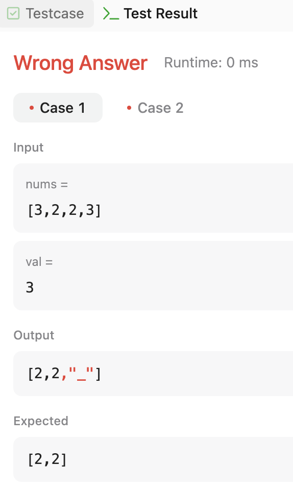

https://leetcode.com/problems/remove-element/description/

## 설계 (소요시간: 15분)
- two pointers
- T= O(N)
- S=O(1)
- edge case : # of V > # of !V
- termination condition : lp >= rp
## 제출 답안지 (소요시간: 5분)

```python
def removeElement(self, nums: List[int], val: int) -> int:
	lp = 0
	rp = len(nums)-1

	while lp < rp:
		while nums[lp] != val:
			lp+=1
			if lp == len(nums)-1:
				break


		while nums[rp] == val:
			rp-=1
			if rp == 0:
				break
		
		if nums[lp] == val and nums[rp] != val:
			nums[lp] = nums[rp]
			nums[rp] = '_'
	
	return rp+1
```

## 검산 (소요시간: 13분)

## 제출



![[blog/images/blog/_posts/2025-03-07-leetcode-27-remove-element/IMG-20250307094733194.png]]
![[blog/images/blog/_posts/2025-03-07-leetcode-27-remove-element/IMG-20250307094733194.png]]
img src="/images/blog/_posts/2025-03-07-leetcode-27-remove-element/IMG-20250307094733194.png" width=300>
img src="/images/IMG_3744.jpeg" width=300>
## 결과 : Wrong Answer

오랜만 + 20분 안에 풀려고 해서 힘들긴 했지만
이거 예전에 한 번 풀었던 문제인데.. 당황스러웠다 ㅠ

솔루션을 보자 [링크](https://leetcode.com/problems/merge-sorted-array/solutions/5714203/video-simple-solution-coding-exercise)

```python
class Solution:
    def merge(self, nums1: List[int], m: int, nums2: List[int], n: int) -> None:
        midx = m - 1
        nidx = n - 1 
        right = m + n - 1

        while nidx >= 0:
            if midx >= 0 and nums1[midx] > nums2[nidx]:
                nums1[right] = nums1[midx]
                midx -= 1
            else:
                nums1[right] = nums2[nidx]
                nidx -= 1

            right -= 1
```

와우.. 놀라우리 만치 단순..
내가 너무 어렵게 생각했나 싶다가도, 생각보다 까다로운 케이스가 있었던 듯

솔루션 공부 후 다시 풀고, 10분만에 제출 완료

```python
class Solution:
    def merge(self, nums1: List[int], m: int, nums2: List[int], n: int) -> None:
        """
        Do not return anything, modify nums1 in-place instead.
        """
        dest = m+n-1
        n1_idx = m-1
        n2_idx = n-1
        
        # until nums2 moves all its elements
        while n2_idx >= 0:
            # if nums1 has larger one, move it to dest
            if nums1[n1_idx] > nums2[n2_idx] and n1_idx >= 0:
                nums1[dest] = nums1[n1_idx]
                n1_idx -= 1
            # otherwise, move nums2's element even if they are the same
            else:
                nums1[dest] = nums2[n2_idx]
                n2_idx -= 1
            dest -= 1
```

Beat 100%? 말이 되나 이게..?ㅋㅋ

![[blog/images/blog/_posts/2025-03-07-leetcode-27-remove-element/IMG-20250307091024932.png]]


2020년에 제출한 솔루션을 보자

```python
class Solution:
    def merge(self, nums1: List[int], m: int, nums2: List[int], n: int) -> None:
        """
        Do not return anything, modify nums1 in-place instead.
        """
        top = len(nums1)-1
        last1 = top-len(nums2)
        last2 = len(nums2)-1
        
        while (last1 >= 0 and last2 >= 0):
            if nums1[last1] > nums2[last2]:
                nums1[top] = nums1[last1]
                top -= 1 
                last1 -= 1 
            else:    
                nums1[top] = nums2[last2]
                top -= 1 
                last2 -= 1 
        
        while last1 >= 0:
            nums1[top] = nums1[last1]
            top -= 1 
            last1 -= 1 
            
        while last2 >= 0:
            nums1[top] = nums2[last2]
            top -= 1 
            last2 -= 1 
         
```

확실히 풀긴 했는데, 상당히 복잡한 듯

## 느낀점
이번에 느낀점은, 생각보다 설계가 중요하다는 것
그리고 손으로 검산하는게 생각보다 중요하다는 것
특별히 배운 자료 구조는 없다!