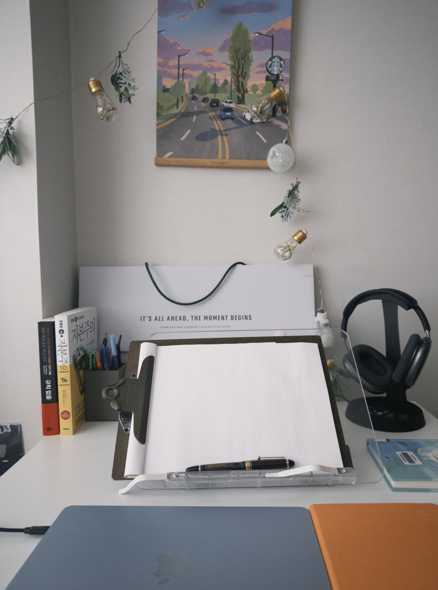

벌써 2026년이라니..
지난 한 해를 돌아보니 정말 많은 일이 있었다.

일단 초에는 결혼을 했고
잊지 못할 신혼여행, 아이슬란드+핀란드 여행을 갔다 왔다.
아직도 가끔 생각나고, 사진첩을 보게 되는- 그런 잊지 못할 너무나도 소중한 추억

이후에는 찌니가 다쳐서 집에서 간호를 하며 지냈고,
찌니가 슬슬 나은 4월부터는 여행을 다니기 시작했다.
4월에는 도쿄를 가고 7월에는 목포, 9월에는 오사카, 10월에는 대만!!!

평소에는 하지 않는 이색 경험도 많이 한 듯 하다, 청계산도 가고 JLPT 시험도 보고..

총 34편의 영화를 봤고 32권의 책을 완독했다.
(영화와 책은 별도의 글로 다시 정리할 예정)

PT를 다시 시작했고 스쿼트 120kg, 데드리프트 100kg, 벤치 90kg으로 마무리 했다.
작년 초에 20kg 빈봉도 겨우 들던 것을 생각하면 정말 장족의 발전..
복싱을 안 하니까 왠지 몸 컨디션이 더 좋아진 듯..

한식을 사랑하게 되었고
경제에 관심을 많이 가지게 되었다
그리고 커리어에 대한 고민도 많이 하게 된거 같다..

올해는 또 어떤 재밌는 일, 새로운 일이 생길지 기대가 된다.
최근 만났던 사람들 중 내 블로그를 재밌게 본다는 사람들이 있어서
올 해는 좀 더 글을 열심히 쓰자고 스스로 다짐하게 되었다

